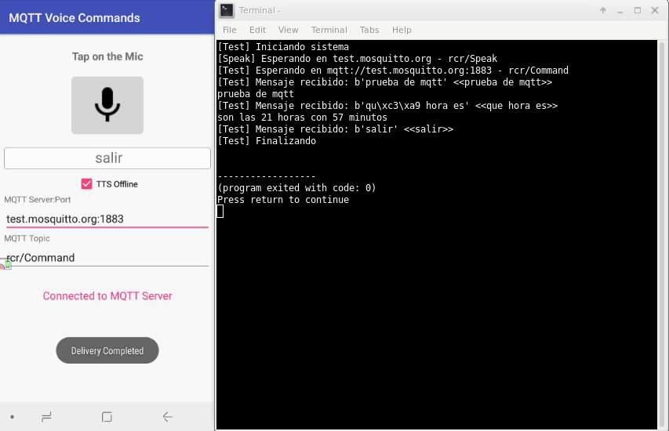

# MQTT Voice Commands
Use voice commands to control your IoT devices (or anything) using MQTT protocol.

Use the apk to send messages. verify with Test.py

Install Java 17.0.6, Android Studio 2022.3.1

open in Android Studio: MQTT_Voice-master\Android | Trust Projekt | Close Tooltips. Not convert!! and not Update!!

Build - Make Project | Select Build Variant - Active Build Variant -> debug | Build Bundles APKs -> apk

APK = MQTT_Voice-master\Android\MQTT Voice\build\outputs\apk\debug\MQTT Voice-debug.apk

